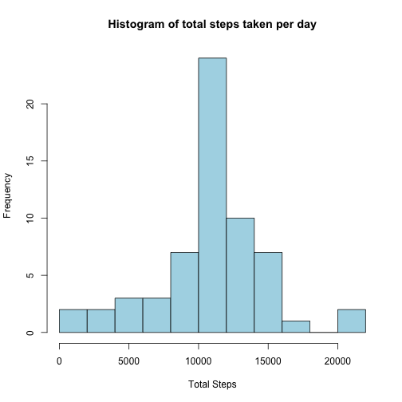

Peer Assignment 1
========================================================

The following code assumes that the data file 'activity.csv' (contained within this repository) is saved into your current working directory.

The following code is used to load the data and convert the 'interval' column from int to factor.


```r
data <- read.csv("activity.csv", header = TRUE, na.strings = "NA")
data$interval <- factor(data$interval)
```
  
  
The next piece of code requires the 'ply'package to already be installed, if not it will install it.

```r
if(require("plyr")){
    print("plyr is loaded correctly")
} else {
    print("trying to install plyr")
    install.packages("plyr")
    if(require(plyr)){
        print("plyr installed and loaded")
    } else {
        stop("could not install plyr")
    }
}
```

```
## Loading required package: plyr
```

```
## [1] "plyr is loaded correctly"
```
  
Now we will plot a historgram of the total number of steps taken each day.


```r
agg_day <- ddply(data, .(date), summarize, total = sum(steps))
hist(agg_day$total, breaks = 10, main = "Histogram of total steps taken per day",
     xlab = "Total Steps", col = "lightblue")
```

 
  
And now to return the mean and median values for total steps per day.


```r
mean(agg_day$total, na.rm = TRUE)
```

```
## [1] 10766
```

```r
median(agg_day$total, na.rm = TRUE)
```

```
## [1] 10765
```


Here we are going to look at the average activiy pattern of the 5-minute intervals. The sum is divided by 53 (as this is the total number of days with data). For this we also need to lattice package installed.


```r
if(require("lattice")){
    print("lattice is loaded correctly")
} else {
    print("trying to install lattice")
    install.packages("lattice")
    if(require(lattice)){
        print("lattice installed and loaded")
    } else {
        stop("could not install lattice")
    }
}
```

```
## Loading required package: lattice
```

```
## [1] "lattice is loaded correctly"
```

```r
agg_time <- ddply(data, .(interval), summarize, average = sum(steps, na.rm = TRUE)/53)

xyplot(average ~ interval, type = "l", agg_time,
       scales = list(x = list(at = seq(0,276,24), labels = seq(000,2200,200))))
```

 


Here we find the 5-minute interval with the maximum number of steps


```r
agg_time[which.max(agg_time[,2]),]
```

```
##     interval average
## 104      835   206.2
```

So from 08:35 to 08:40 is the 5 minute interval with the highest average number of steps across all days - with an mean of 206.2 steps.  
  
  
Now lets replace any NA values with the average (mean) number of steps taken for that particular 5 minute time interval (as calculated in agg_time).

This new data frame is then used in creationg a histogram of total steps taken per day and also for returning the mean and median steps taken per day.


```r
new_data <- data
new_data$steps <- ifelse(is.na(new_data$steps), agg_time$average, new_data$steps)
agg_day_new <- ddply(new_data, .(date), summarize, total = sum(steps))
hist(agg_day_new$total, breaks = 10, main = "Histogram of total steps taken per day",
     xlab = "Total Steps", col = "lightblue")
```

 

```r
mean(agg_day_new$total)
```

```
## [1] 10766
```

```r
median(agg_day_new$total)
```

```
## [1] 10766
```

We can see that adding in the average (mean) number of steps taken for the missing values has had no effecdt on the mean number of steps taken per day, and has raised the median from 10765 to 10766.


Now we wish to investigate the differences between weekdays and weekends. As such we need a new column in the new_data table to flag whether the data is a weekday or a weekend. After this is done ddply is used again to summarize the mean number of steps taken on either weekends or weekdays for a given 5 minute interval.


```r
new_data$weekend <- ifelse(weekdays(as.POSIXct(new_data$date)) %in% c("Saturday","Sunday"), "Weekend", "Weekday")
agg_time_new <- ddply(new_data, .(weekend, interval), summarize, average = sum(steps, na.rm = TRUE)/61)
```

Now we can create the plot and see if there is a difference.


```r
xyplot(average ~ interval | factor(weekend), type = "l", agg_time_new, layout = c(1, 2),
       scales = list(x = list(at = seq(0,276,24), labels = seq(0,2200,200))))
```

 

It looks as though wekeends generally have less activity overall, the most obvious difference being between about 6:00 and 9:00 where on the weekdays there is a massive peak (people going to work?) whilst on the weekend there is noway near the same level of activity (having a lie in?).
